# Inventory Management System

An efficient software solution to manage and track inventory levels, orders, and deliveries, designed to optimize stock management for businesses.


## Features

#### User Side :
- **User login/Registration**
- **Dashboard**
- **Product Manage** (Add, Edit, Delete)
- **Customer Manage** (Add, Edit, Delete)
- **Sales Manage** (Add, Delete)
- **Profile Manage** (Add, Edit, Delete)
- **Show Available Products**

#### Admin Side :
- **Manage Customer** (Add, Edit, Delete)
- **Check Products Details** (View Only)
- **Check Customers Details** (View Only)
- **Check Order Details** (View Only)

## Technologies Used

- Backend: **PHP**
- Database: **MySQL**
- Frontend: **HTML, CSS, JavaScript**
- Framework: **Bootstrap 5**
## Installation  
Follow these steps to set up the project locally:  

### Step 1: Clone the Repository  
Run the following command:  
```bash
git clone https://github.com/patelharshn/InventoryProject.git
```

### Step 2: Create Folder
```bash
C:\xampp\htdocs\IMS
```

### Step 3: Start Apache and Mysql
```bash
- Open XAMPP
- Start Apache and Mysql
```

### Step 4: Create DataBase
```bash
- Open phpMyAdmin
- Create DataBase with 'ims' name
```

### Step 5: Import Tables
```bash
-  Click import and select database file.
```

## Screenshots  

#### Signup Page
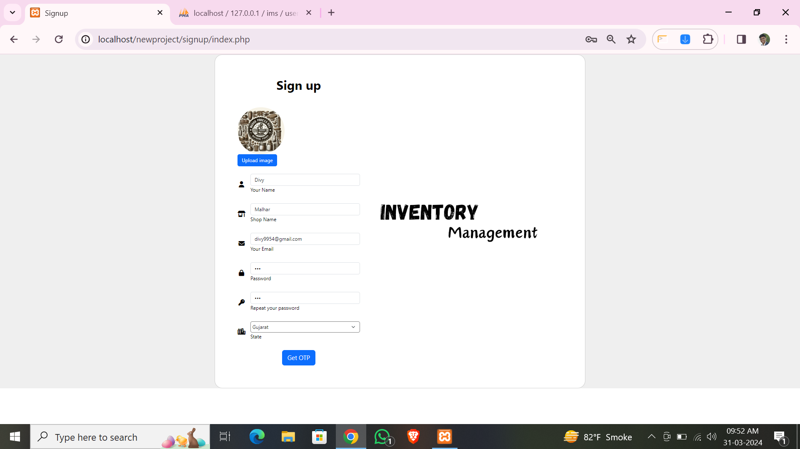

#### Login Page
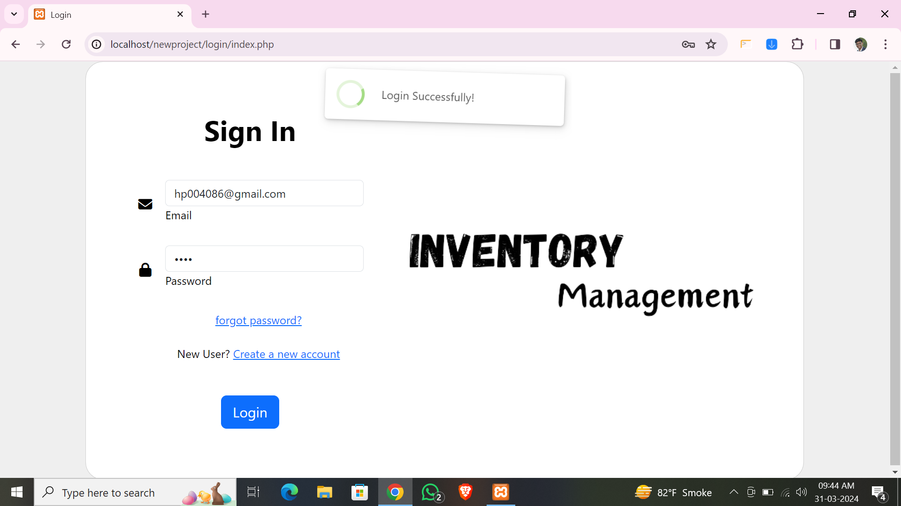

#### Dashboard Page
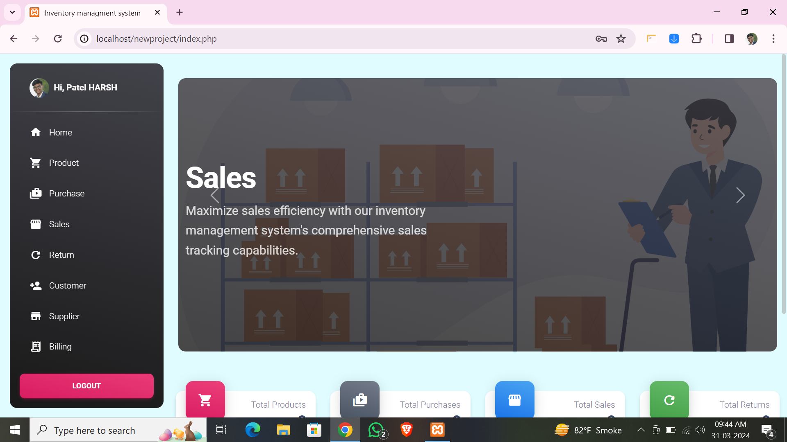

#### Products Page
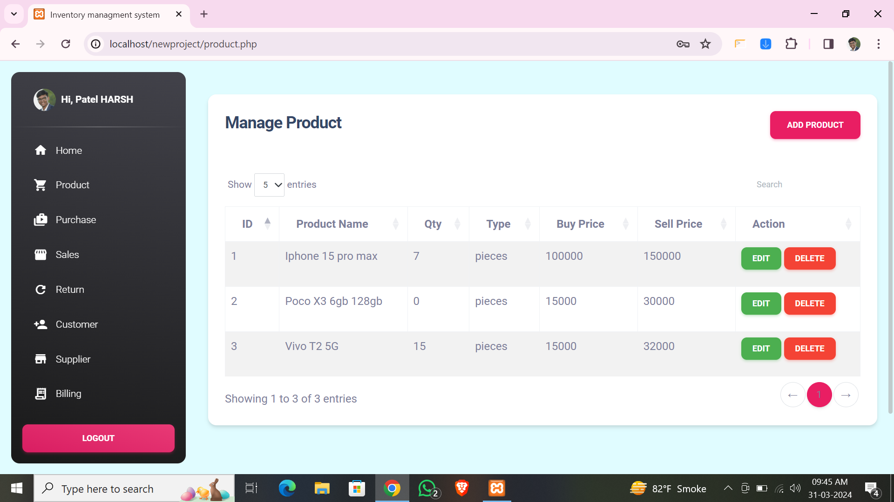

#### Customers Page
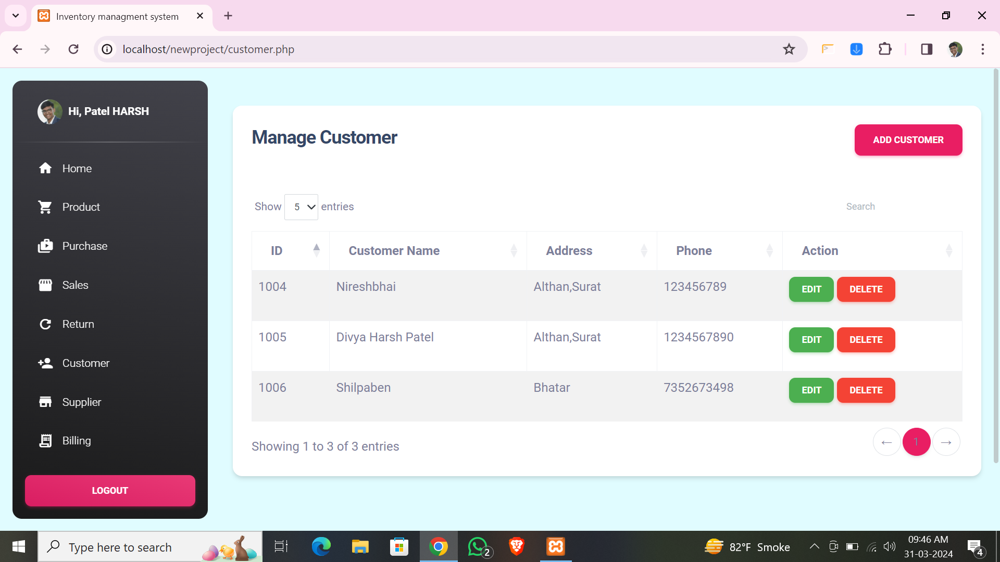

#### Supplier Page
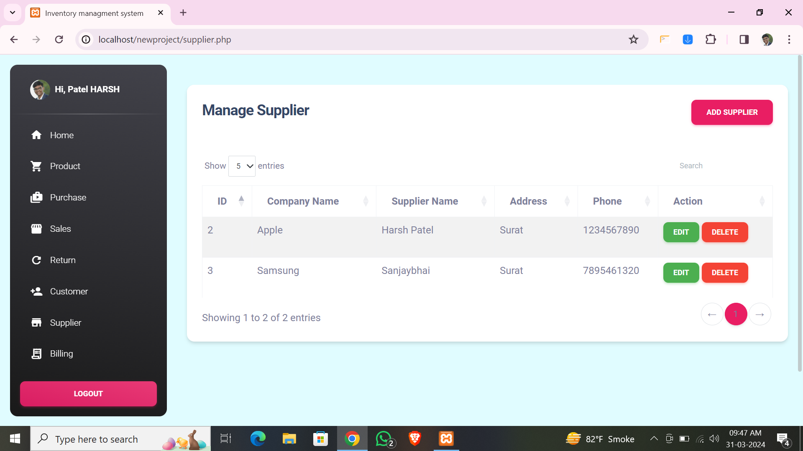

#### Sales Page
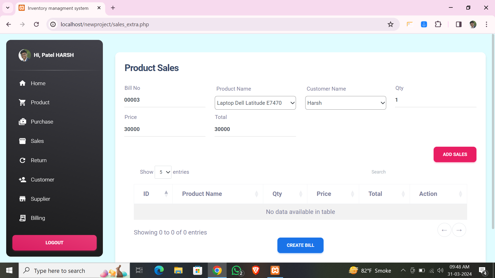

#### Purchase Page
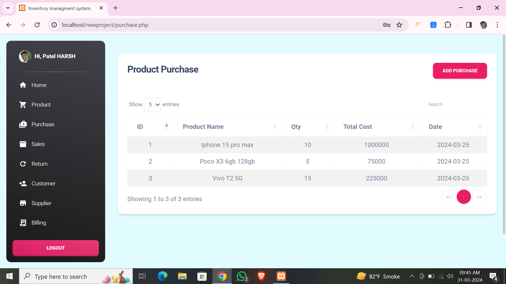

#### Report Page
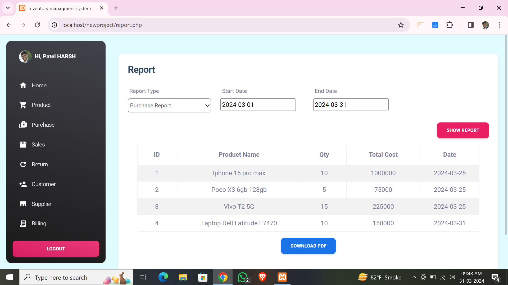

#### Bills Page
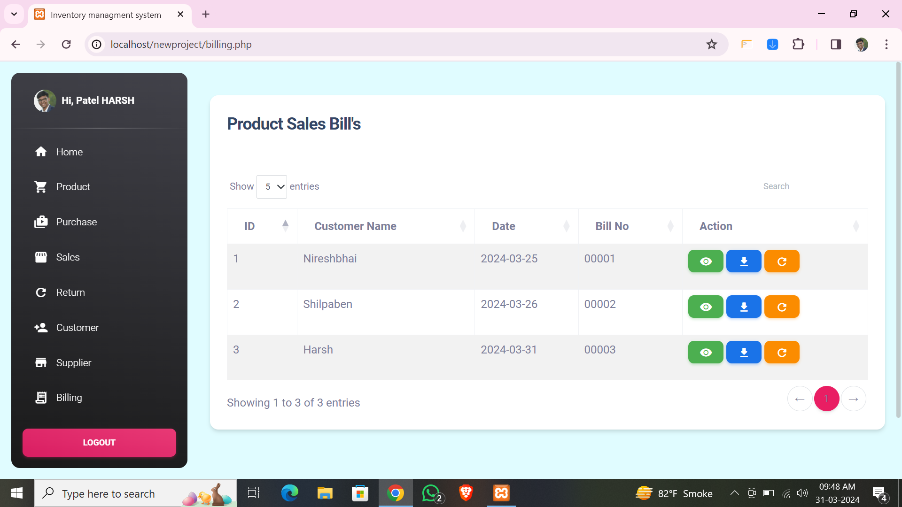

#### Bill Demo
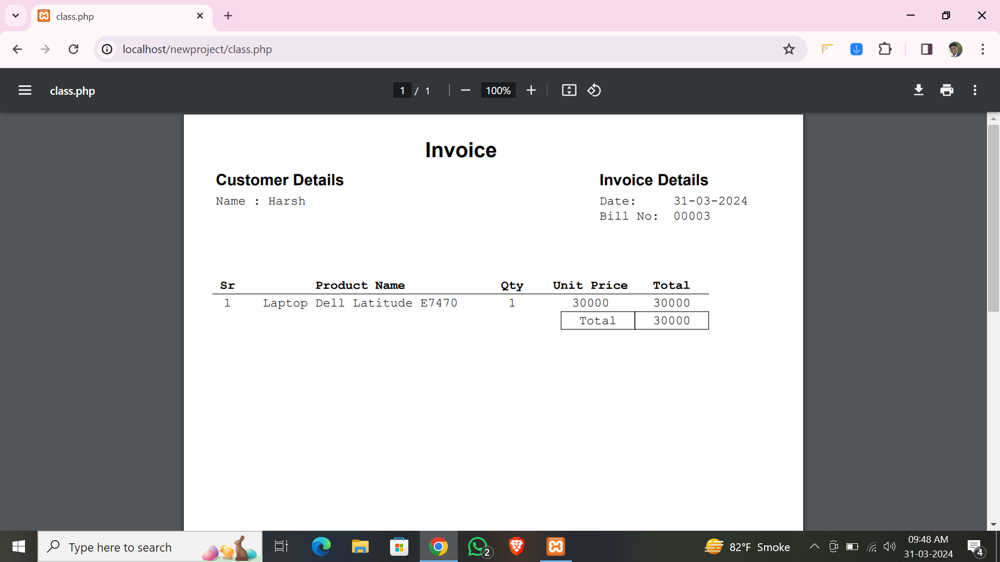

#### OTP Page
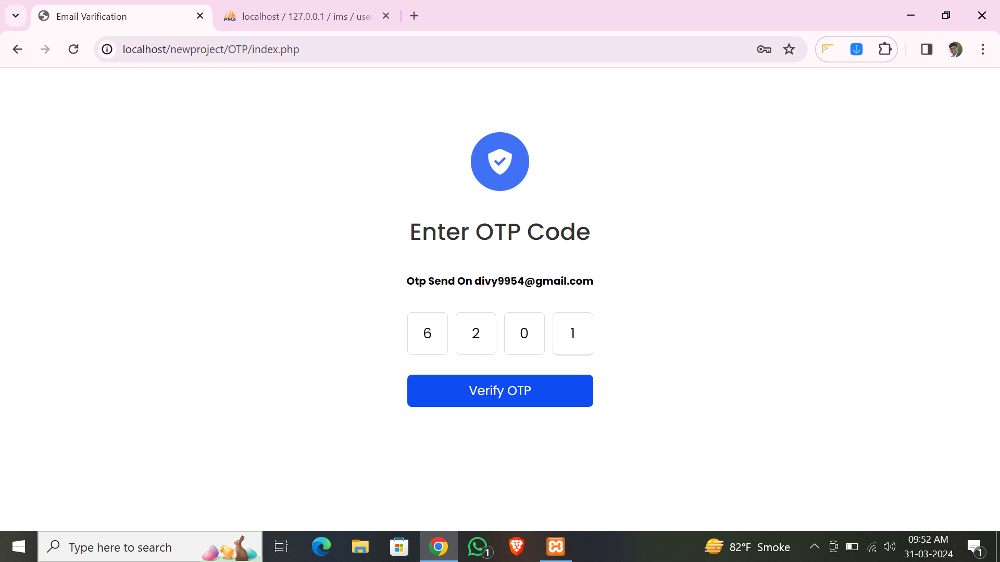

#### User Profile Page


## Contact  

For further information or feedback, please contact:
- **Email**: harshpatel4086@gmail.com
- **GitHub Profile**: [patelharshn](https://github.com/patelharshn)


## Feedback

If you have any feedback, please reach out to us at harshpatel4086@gmail.com

